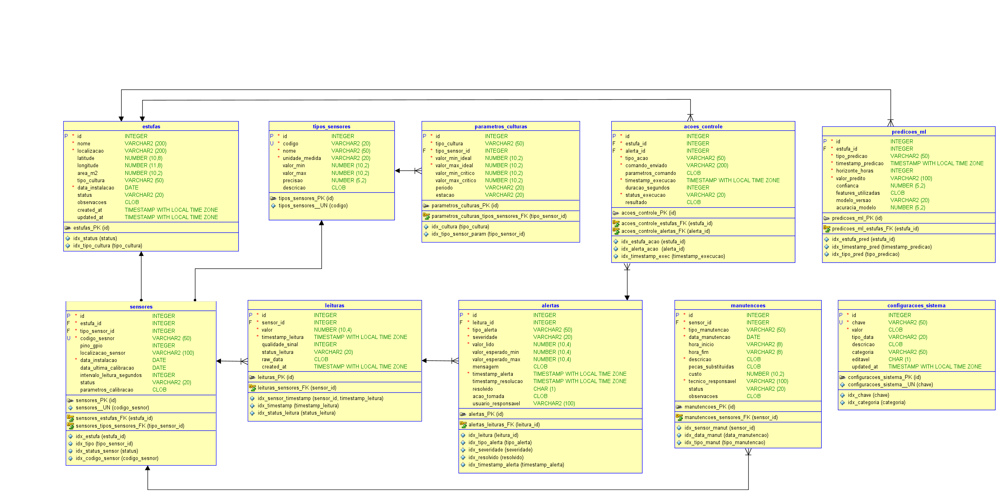

# FIAP - Faculdade de Informática e Administração Paulista 

<p align="center">
<a href= "https://www.fiap.com.br/"></a>
</p>

<br>

#🌱 Cap 1 - FarmTech na era da cloud computing


### ▶️ Vídeo de Evidência do Funcionamento do Projeto.

[https://youtu.be/aj7z-3DHy9c](https://youtu.be/aj7z-3DHy9c)

## Grupo

## 👨‍🎓 Integrantes: 
| Matrícula                 | Aluno               						  |
|---------------------------|---------------------------------------------|
|        RM 565497          | Vera Maria Chaves de Souza				  | 
|        RM 565286          | Diogo Rebello dos Santos					  |


## 👩‍🏫 Professores:
### Tutor(a) 
- <a href="#">Leonardo Ruiz Orabona</a>
### Coordenador(a)
- <a href="#">André Godoi Chiovato</a>


## 📜 Descrição

Estufa Inteligente com IoT, Banco de Dados e Machine Learning

Este projeto integra IoT (ESP32 + sensores simulados no Wokwi), API REST em Flask, banco de dados relacional (MySQL/Oracle/SQL Server) e modelos de Machine Learning para tomada de decisão inteligente em uma estufa agrícola.

O objetivo é coletar dados de sensores (temperatura, umidade, luminosidade, solo etc.), armazenar em banco de dados, treinar modelos de predição e disponibilizar uma API para ingestão e consulta dos dados, simulando uma solução completa de Agricultura Inteligente.

## 📁 Estrutura de pastas

```
FASE_5_ENTERPRISE_CHALLENGE/
│
├── assets/                        # Recursos visuais para documentação
│   ├── diagrama_er.png            # Diagrama entidade-relacionamento
│   ├── esp32.png                  # Imagem ilustrativa do ESP32
│   ├── logo-fiap.png              # Logo da FIAP para o projeto
│
├── document\scripts/              # Scripts SQL para criação do banco
│   ├── create_tables_mysql.sql
│   ├── create_tables_oracle_21c.sql
│   ├── create_tables_sql_server_2012.sql
│   ├── insert_sample_data.sql
│
├── src/                           # Código-fonte principal do projeto
│   │
│   ├── api/                       # API Flask + Swagger
│   │   ├── app.py
│   │   ├── requirements.txt
│   │
│   ├── database/modelo_er/        # Modelo lógico do banco
│   │   ├── estufa_inteligente_model/   # Pasta com arquivos do Oracle Data Modeler
│   │   ├── estufa_inteligente_model.dmd
│   │
│   ├── hardware/esp32_wokwi/      # Simulação IoT no Wokwi
│   │   ├── .pio/                  
│   │   ├── .vscode/
│   │   ├── src/                   # Código do ESP32 (C/C++)
│   │   ├── diagram.json           # Esquema de montagem no Wokwi
│   │   ├── platformio.ini         # Configuração do PlatformIO
│   │   ├── wokwi.toml             # Configuração do simulador Wokwi
│   │
│   ├── machine_learning/          # Scripts e modelos de ML
│       ├── amostras/
│       │   ├── amostra.csv        # Dados de exemplo para treino/teste
│       ├── models/
│       │   ├── model.joblib       # Modelo treinado
│       │   ├── model_info.json    # Informações do modelo
│       ├── .env                   # Variáveis de ambiente
│       ├── predict_model.py       # Script de predição
│       ├── train_model.py         # Script de treino
│       ├── requirements.txt       # Dependências de ML
│
├── README.md                      # Documentação principal do projeto

```

## ⚙️ 1. API (Flask + Swagger)
A API foi desenvolvida em Flask e documentada com Flasgger/Swagger, permitindo ingestão de leituras dos sensores e consulta do status de irrigação.

### 📌 Como rodar a API:
```bash
cd api
pip install -r requirements.txt
python app.py
```
Acesse no navegador:
👉 http://localhost:5000/apidocs para visualizar a documentação Swagger.

Endpoints principais:

- POST /leituras → Envia leituras de sensores.
- POST /leituras/batch → Envia várias leituras de uma vez.
- GET /status → Consulta status da irrigação.
- GET /ml/features → Features esperadas pelo modelo.
- POST /ml/predict → Objeto ou lista de objetos contendo as features usadas no treino (veja /ml/features)
- GET /ml/features/now → Predição com a última leitura de cada sensor.

## 2. Banco de Dados
- Escolha o SGBD desejado.
- Rode o script correspondente (create_tables_*.sql).
- (Opcional) Insira dados de exemplo com insert_sample_data.sql.

### Modelo Relacional:



### 📌 Exemplo no MySQL:
```bash
mysql -u usuario -p estufa < database/scripts/cretate_tables_mysql.sql
mysql -u usuario -p estufa < database/scripts/insert_sample_data.sql
```


## 🔌 3. Hardware (ESP32 + Wokwi)
A pasta hardware/esp32_wokwi contém o código do ESP32 e os arquivos de simulação no Wokwi.
São simulados sensores como:

### 🖼️ Circuito no Wokwi:


🌡️ DHT22 (Temperatura/Umidade do ar)
🌱 Sensor de solo (umidade do solo)
💡 LDR (luminosidade)
🌡️ LM35 (temperatura do solo)
📌 Como rodar a simulação:

- Abra o projeto no Wokwi.
- Carregue o diagram.json.
- Rode a simulação.
- O ESP32 enviará leituras para a API.


## 🤖 4. Machine Learning
Aqui treinamos e testamos um modelo preditivo de irrigação, utilizando Scikit-Learn.

### 📌 Passos:
1. Instale dependências
```bash
cd machine_learning
pip install -r requirements.txt
```

2. Treine o modelo:
```bash
python train_model.py
```
→ Isso gera models/model.joblib e models/model_info.json.

3. Teste previsões:
```bash
python predict_model.py
```

4. O modelo recebe variáveis como umidade do solo, temperatura, luminosidade e retorna se deve ou não ativar irrigação.


## 📊 5. Fluxo Geral do Projeto

1. ESP32 (Wokwi) coleta dados dos sensores.
2. Os dados são enviados via API Flask.
3. A API grava no Banco de Dados.
4. O modelo de Machine Learning é treinado e consulta os dados.
5. A API pode usar o modelo para sugerir ações de irrigação.


## 📌 6. Tecnologias Utilizadas

- IoT/Hardware: ESP32, Wokwi, PlatformIO
- Backend/API: Python + Flask + Flasgger (Swagger)
- Banco de Dados: MySQL, Oracle 21c, SQL Server 2012
- Machine Learning: Scikit-Learn, Joblib, Pandas, Numpy
- Documentação: Swagger + ER Diagram (Oracle Data Modeler)

## 🚀 Como Executar o Projeto Completo

- Configure o banco de dados e rode os scripts SQL.
- Inicie a API Flask (api/app.py).
- Rode a simulação do ESP32 no Wokwi.
- Treine o modelo em machine_learning/train_model.py.
- Use predict_model.py para prever se a estufa deve irrigar.


## 🗃 Histórico de lançamentos

* 0.1.0 - 01/09/2025 (Projeto Atual)
    

## 📋 Licença

<p xmlns:cc="http://creativecommons.org/ns#" xmlns:dct="http://purl.org/dc/terms/"><a property="dct:title" rel="cc:attributionURL" href="https://github.com/agodoi/template">MODELO GIT FIAP</a> por <a rel="cc:attributionURL dct:creator" property="cc:attributionName" href="https://fiap.com.br">Fiap</a> está licenciado sobre <a href="http://creativecommons.org/licenses/by/4.0/?ref=chooser-v1" target="_blank" rel="license noopener noreferrer" style="display:inline-block;">Attribution 4.0 International</a>.</p>


